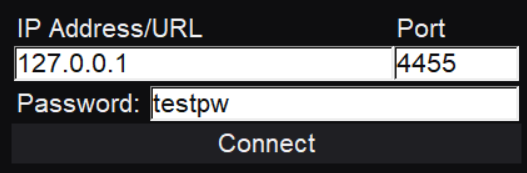

# obswsgui

GUI for interacting with OBS through a WebSocket server.

## Downloads

Check the [GitHub releases](https://github.com/lusciousdev/obswsgui/releases).

## Using obswsgui

### Connecting to a WebSocket server

Input the IP address, port, and password for the OBS WebSocket server you wish to connect to.

### Adding images

All image URLs must be accessible by the OBS client you are interfacing with. If you want to add an image that you have locally your best bet is uploading to a site like imgur and copying the URL.

### Adding text

There's a dropdown in the add dialog, select the type of source you need. There are a few special types of text sources.

#### Countdowns

Countdown sources are a timer that decrements to whatever date/time you set in the dialog. Max countdown timer is 24 hours, the default is 1 hour. The end time must be given in the format "YYYY-MM-DD HH:mm:ss" (24 hour time).

If you close the OBS WS GUI and reopen all countdown sources will be reverted to plain text sources. You will have to recreate the countdown source t o get it back working.

#### Timers

Timer sources count up from the moment they are made. They can be paused or reset in the side panel when selected. 

If you close the OBS WS GUI and reopen all timer sources will be reverted to plain text sources. You will have to recreate the countdown source t o get it back working.

### Manipulating sources

Click and drag to move, click corners or sides to resize. The circle up top is for rotating a source. If a source is underneath something you can double click to cycle through the sources under your mouse.

### Duplicating sources

Duplicated sources will be created with the same position, name, and size as the original. BE CAREFUL WITH SOURCES SHARING NAMES. Any changes you make to one source changes all sources that share it's name.

### Moving sources to the top of the stack

To reorder images you can hit move to the front when selecting one of the moveable sources. This will move it to the front of the scene for you and the OBS server.

## Running from source

Just run ./src/main.py, you'll need to install PIL and simpleobsws